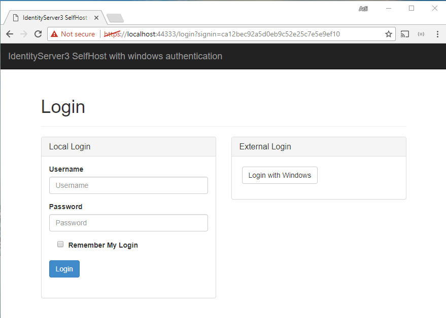

# SecurityTokenService implementations
## SelfHosted Security Token Service with Windows Authentication
Self hosted Security Token Service fully integrated with Windows Authentication

## Security Token Service Administration protected with Windows Authentication
In this implementation, only an user which belongs to a certain Active Directory group, can login to the Identity Administration
