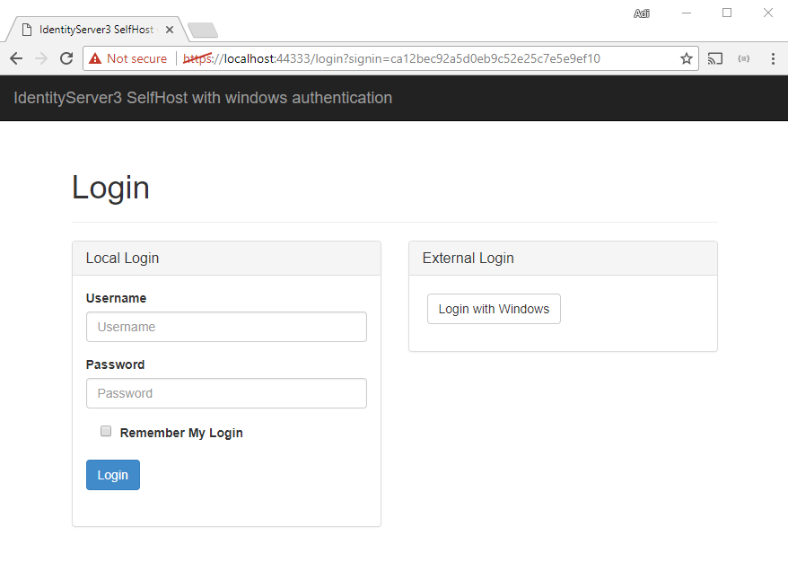
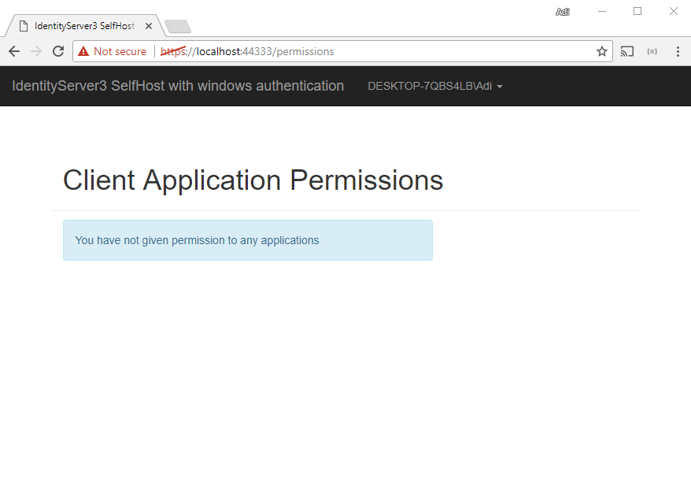
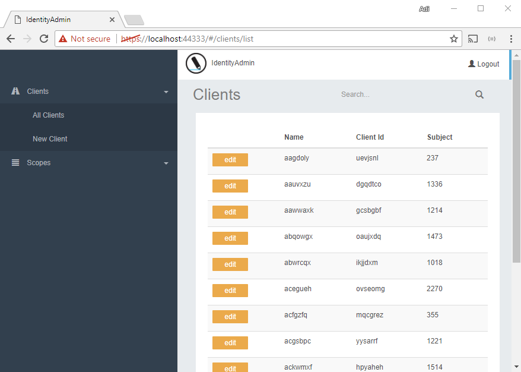

# SecurityTokenService implementations
## SelfHosted Security Token Service with Windows Authentication
Before Windows login



After Windows login


## Security Token Service Administration protected with Windows Authentication
In this implementation, only an user which belongs to a certain Active Directory group, can login to the Identity Administration. Identity administration runs in self host mode.

```csharp
app.Map("/windows", ConfigureWindowsTokenProvider);
private static void ConfigureWindowsTokenProvider(IAppBuilder app)
{
    app.UseWindowsAuthenticationService(new WindowsAuthenticationOptions
    {
        IdpReplyUrl = "https://localhost:44333/",
        IdpRealm = "urn:idsrv3",
        SigningCertificate = Certificate.Get(),
        CustomClaimsProvider = new AdditionalCustomClaimsProvider()
    });
    app.UseWindowsAuthentication();
}
```

```csharp
app.Map("", adminApp =>
{
    adminApp.UseCookieAuthentication(new CookieAuthenticationOptions()
    {
        AuthenticationType = "Cookies"
    });

    adminApp.UseWsFederationAuthentication(new WsFederationAuthenticationOptions
    {
        SignInAsAuthenticationType = "Cookies",
        MetadataAddress = "https://localhost:44333/windows",
        Wtrealm = "urn:idsrv3"
    });

    adminApp.UseIdentityAdmin(new IdentityAdminOptions
    {
        Factory = CreateIdentityAdminServiceFactory(),
        AdminSecurityConfiguration = new AdminHostSecurityConfiguration
        {
            HostAuthenticationType = "Cookies",
            NameClaimType = "name",
            AdminRoleName = "IdentityAdmin", //Claim value which was added in AdditionalCustomClaimsProvider
            RoleClaimType = "IdentityAdmin", //Claim type which was added in AdditionalCustomClaimsProvider
        }
    });
});
```

```csharp
internal class AdditionalCustomClaimsProvider : ICustomClaimsProvider
    {
        private const string AdminWindowsGroupName = "IdentityAdministrators";

        public Task TransformAsync(CustomClaimsProviderContext context)
        {
            if (context.WindowsPrincipal.IsInRole(AdminWindowsGroupName))
                context.OutgoingSubject.AddClaim(new Claim("IdentityAdmin", "IdentityAdmin"));
            return Task.FromResult(0);
        }

    }
```


